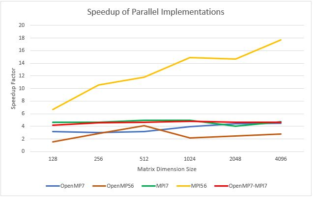

# MatrixMultiplicationParallelization
Algorithms that increase the speed of matrix multiplication using parallel programming

## Summary
As part of a group project, I attempted to increase the performance of matrix multiplication using [parallel programming](https://en.wikipedia.org/wiki/Parallel_computing) techniques. First, I created a serial implementation of [Strassen's matrix multiplication algorithm](https://iq.opengenus.org/strassens-matrix-multiplication-algorithm/) in C++ to use to establish a performance baseline. I then created several C++ parallel implementations of Strassen's method with the [OpenMP](https://en.wikipedia.org/wiki/OpenMP) and [MPI](https://en.wikipedia.org/wiki/Message_Passing_Interface) parallel programming libraries. Finally, I ran all implementations on a university supercomputer and compared runtimes. Depending on the size of matrices used, matrix multiplication ran a

## Implementations
The implementations all auto-generate 2 square matrices filled with random integers given a matrix dimension size and maximum matrix element value specified at execution time. The algorithms then time how long it takes to multiply the 2 matrices together. Each implementation was run using a variety of matrix dimension sizes to see how the implementation scaled as the matrices multiplied together got larger.

* [StrassenSerial.cpp](StrassenSerial.cpp) - A serial implementation of Strassen's matrix multiplication algorithm
* [OpenMP7.cpp](OpenMP7.cpp) - A parallel implementation that runs with 7 threads on one multi-core CPU node as long as the dimension size of the matrices being multiplied together is greater than 2
* [OpenMP56](OpenMP56.cpp) - A parallel implementation that runs with up to 56 threads on one multi-core CPU node depending on the dimension size of the matrices
* [MPI7.cpp](MPI7.cpp) - A parallel implementation that concurrently uses 7 nodes for matrix multiplication as long as the dimension size is greater than 2 
* [MPI56.cpp](MPI56.cpp) - A parallel implementation that uses up to 56 nodes for matrix multiplication depending on the matrix dimension size
* [OpenMP7-MPI7.cpp](OpenMP7-MPI7.cpp) - A parallel implementation that uses up to 7 nodes and runs up to 7 threads on each node for matrix multiplication

## Results
As Figure 1 shows, the OpenMP7 implementation executed 3 to 4 times faster than the StrassenSerial implementation. The OpenMP7-MPI7 implementation performed about the same as the MPI7 implementation, indicating that the number of nodes used for matrix multiplication is more important than the number of threads running on each node. The OpenMP56 implementation was the slowest of all parallel implementations; it appears that the number of cores available to run threads was a bottleneck. Although each node of the supercomputer used for testing had 32 cores, this implementation needed 56 to run all 56 threads simultaneously. Finally, the MPI56 implementation, which used a maximum of 56 nodes for matrix multiplication, had the fastest runtime. It ran almost 18 times faster than the StrassenSerial Implementation.

   
  
   
  Figure 1 - Speedup of parallel implementations of Strassen's algorithm compared to the serial implementation

